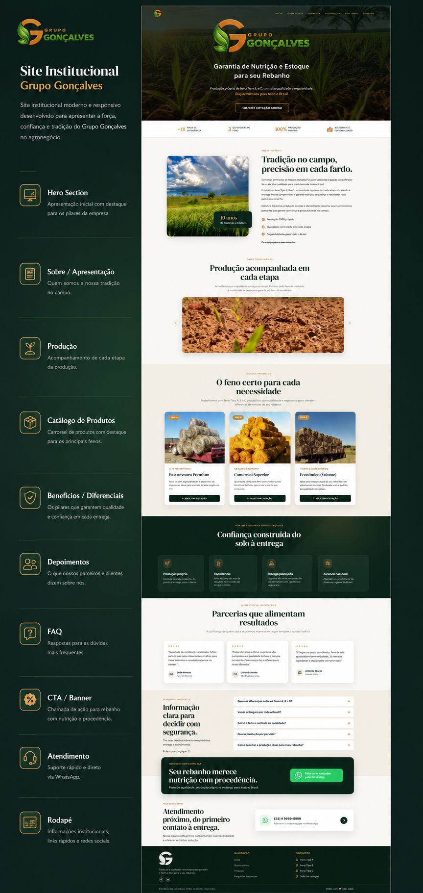

# Grupo Gonçalves

O projeto **Grupo Gonçalves** é uma landing page profissional desenvolvida para apresentar a empresa e facilitar a comercialização de feno de alta performance (Tipos A, B e C) para pecuaristas e produtores em todo o Brasil.

## 📄 Sobre o Projeto

Esta landing page foi feita para transmitir a tradição e a tecnologia do Grupo Gonçalves, que possui mais de 10 anos de experiência no campo. A interface foca em apresentar a qualidade da produção própria, o catálogo detalhado de produtos e converter visitantes em clientes através de chamadas diretas para orçamento via WhatsApp.

## 📸 Visual do Site

## 🔗 Link de Acesso

O site está publicado e pode ser acessado através do link:  
👉 [https://grupogoncalves.vercel.app](https://grupogoncalves.vercel.app)

## 🛠️ Tecnologias Utilizadas

*   **HTML5:** Estruturação semântica e acessível.
*   **CSS3:** Estilização moderna utilizando variáveis, Flexbox, Grid e animações personalizadas (Reveal on Scroll).
*   **JavaScript (Vanilla):** Implementação de menu mobile, navegação suave, lógica de scroll da navbar e carrossel interativo na página de produções.
*   **Font Awesome:** Ícones para redes sociais e utilitários.
*   **Google Fonts:** Tipografia refinada com as fontes *DM Serif Display* e *DM Sans*.

## 🚀 Funcionalidades Principais

*   **Design Responsivo:** Adaptado perfeitamente para dispositivos móveis, tablets e desktops.
*   **Carrossel de Produção:** Galeria dinâmica para visualização das etapas do plantio ao carregamento.
*   **Integração com WhatsApp:** Botões estratégicos e flutuantes para contato imediato.

---

Obrigado por visitar este projeto! Ele reflete o compromisso com a excelência e a nutrição de alta performance no campo.